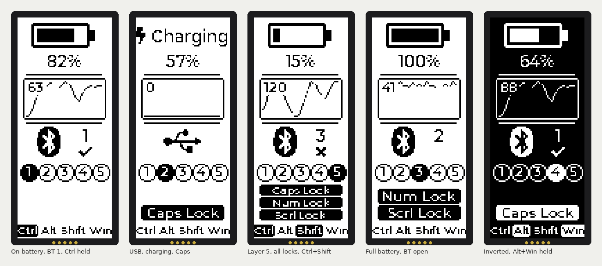

# Nice Pillz ZMK Config

## Overview
ZMK Configurations for the the NicePillz Board: https://github.com/nol00p/NicePillz
The layout is Linux/Gnome driven.

## Hardware
- The PCB is updated for this header, see below.
- For the original design and the thumb pads, see https://github.com/nol00p/NicePillz
- For the rubber function buttons replacement with PCB for the older Advantage 1, these are excellent https://github.com/bluelightning32/kinesis-fn

## Features supported
- [x] ZMK Studio 
- [x] nice!view display (vertical): battery/charging, WPM, BT profile, layer, lock indicators
- [x] Leader key
- [x] Home row mode
- [x] caps word
- [x] Helper.h
- [x] Tri State Layer
- [x] Macro
	- [x] with unicode support. 
###### Supported but not yet tested
- [ ] Combo

## Battery level Tweaks
the battery reporting is included so it can be visible in the os. 
bluetooth and power status update too for better experience. 

## Display (nice!view)
The v9 board carries a nice!view (Sharp 160x68 memory LCD), mounted vertically with the header
pins at the bottom. The status screen (`boards/shields/nicepillz/view_draw.c`) is drawn upright
and rotated into the panel, top to bottom:



1. **Battery** - a battery-shaped gauge plus the percentage. On USB power the gauge is replaced by
   a lightning bolt and the word *Charging*.
2. **Words per minute** - a bare number, refreshed at most every 5 s
   (`CONFIG_NICEPILLZ_WPM_INTERVAL_MS`).
3. **Output** - a Bluetooth logo with the active profile number and a tick (connected) or cross
   (bonded but not connected); a USB symbol when USB is the selected output.
4. **Layer** - five numbered dots; the filled one is the highest active layer (1-5).
5. **Lock indicators** - *Caps Lock*, *Num Lock*, *Scrl Lock* boxes at the bottom, stacked; they
   use the host's HID lock state, replacing the old LEDs.

Options (`Kconfig.defconfig`, override in `nicepillz.conf`):
- `CONFIG_ZMK_DISPLAY=n` disables the display entirely.
- `CONFIG_NICEPILLZ_DISPLAY_INVERTED=y` draws white on black.

### Preview renders
`tools/preview/build.sh` compiles the real drawing code against LVGL on the host and writes
`docs/display-preview.png`, so layout changes can be checked without flashing.

Wiring (from `kicad/nice_pillz_niceview_v10`): the display shares the SPI bus with the 74HC595
column driver. SCK = P0.11 (D7), MOSI = P0.24 (D5), display CS = P1.01, powered from the
nice!nano VCC pin (switched off in deep sleep together with the shift register).

The J9 display header in the KiCad file is ordered CS, GND, 3V3, SCK, MOSI (top to bottom) to
match the nice!view's own pin order, so a future board can take the display straight on the header.
Boards made from the original v9 layout have J9 as GND, MOSI, CS, SCK, 3V3 and need the display
wired pin by pin. Pad numbers and nets are unchanged, so the schematic still matches; only the pad
positions inside the footprint instance moved (re-importing the footprint from the library would
undo this).

## LED Behavior
the power led shows the power status of the Board. the ble led, shows when the board is connected to bluetooth.
On the v9 board the power LED is driven by the spare 74HC595 output (QA) because P1.01 is used
as the display chip select; the BLE LED stays on P1.02.
Sleep modes: 
sleep (timer 5min): pwr led flashs, ble led off. 
Deep Sleep (timer 20min): both led off

## Sleep modes
Sleep, 5 min timer - any keys to resume
Deep Sleep, 20 min timer - press the esc key (0,0) to wake the board up.

## PCB / ordering from JLCPCB
`kicad/nice_pillz_niceview_v10.kicad_pcb` is the board (KiCad 10). Ready-to-upload fabrication
files are in `kicad/jlcpcb/`:

- `nice_pillz_niceview_v10_jlcpcb.zip` - upload this as-is to JLCPCB (2 layers, 1.6 mm).
- `gerbers/` - the same files unzipped: copper, mask, paste, silkscreen, board outline (Protel
  extensions), Excellon drills split into PTH / NPTH, and a drill map.

They were generated with `kicad-cli` from the board as committed (zones refilled, DRC run:
0 unconnected items; the remaining DRC items are pre-existing courtyard/silkscreen/library
warnings). Regenerate after any layout change:

```
kicad-cli pcb export gerbers --output kicad/jlcpcb/gerbers/ \
  --layers "F.Cu,B.Cu,F.Paste,B.Paste,F.SilkS,B.SilkS,F.Mask,B.Mask,Edge.Cuts" \
  --subtract-soldermask --no-x2 --no-netlist --disable-aperture-macros kicad/nice_pillz_niceview_v10.kicad_pcb
kicad-cli pcb export drill --output kicad/jlcpcb/gerbers/ --format excellon --excellon-units mm \
  --excellon-zeros-format decimal --excellon-separate-th --drill-origin absolute \
  --generate-map --map-format gerberx2 kicad/nice_pillz_niceview_v10.kicad_pcb
cd kicad/jlcpcb/gerbers && zip ../nice_pillz_niceview_v10_jlcpcb.zip *
```

Changes in v10 (silkscreen v1.1) compared with the v9 boards already made:

- **J9 display header** is ordered CS, GND, 3V3, SCK, MOSI to match the nice!view (see Display above).
- **Switch LED header** replaces the external reset terminal at the top of the board (same two holes).
  It is a 2-pin 2.54 mm header for the LED inside an illuminated power switch: the square pin (marked
  `+`) is the LED anode, fed from the switched 3.3 V rail through **R3** next to it; the round pin is
  GND. Fit R3 to suit the LED: 330 R for red/green/yellow (about 4 mA), 100 R for blue/white. The
  LED is on whenever the keyboard is powered: off when the power switch is off, off in deep sleep
  (the firmware cuts the 3.3 V rail), and on while charging over USB even with the switch off. The
  onboard reset push button is unchanged; there is no longer a terminal for an external reset.
- D1/D2 are labelled LED_PWR / LED_BLE on the fab layer.

## Building locally
GitHub Actions builds on every push (`build.yaml`). To build on a machine with Docker:

```
mkdir -p .zmk/config && cp config/west.yml .zmk/config/west.yml
docker run --rm --user $(id -u):$(id -g) -e HOME=/tmp -v "$PWD":/workspace -w /workspace/.zmk \
  zmkfirmware/zmk-build-arm:stable bash -c 'west init -l config && west update'
docker run --rm --user $(id -u):$(id -g) -e HOME=/tmp -v "$PWD":/workspace -w /workspace/.zmk \
  zmkfirmware/zmk-build-arm:stable bash -c 'west zephyr-export >/dev/null; \
  west build -s zmk/app -d build/nicepillz -b nice_nano_v2 -S studio-rpc-usb-uart -- \
    -DSHIELD=nicepillz -DZMK_CONFIG=/workspace/config -DZMK_EXTRA_MODULES=/workspace -DCONFIG_ZMK_STUDIO=y'
```

The firmware ends up in `.zmk/build/nicepillz/zephyr/zmk.uf2`.

## Extra

A quick shell script to get the battere state of the keyboard on the CLI.

```
!/bin/bash
# Compact colored battery display

# Colors
RED='\033[0;31m'
GREEN='\033[0;32m'
YELLOW='\033[1;33m'
BLUE='\033[0;34m'
NC='\033[0m'

if [ $# -ne 1 ]; then
  echo "Usage: $0 MAC_ADDRESS"
  exit 1
fi

battery=$(bluetoothctl info "$1" | awk -F'[()]' '/Battery Percentage/ {print $2}')

if [ -z "$battery" ]; then
  echo -e "${RED}✗ No battery info${NC}"
  exit 1
fi

# Choose color based on battery level
if [ "$battery" -ge 70 ]; then
  color=$GREEN
  icon="🔋"
elif [ "$battery" -ge 30 ]; then
  color=$YELLOW
  icon="🔋"
else
  color=$RED
  icon="🪫"
fi

# Create simple bar
filled=$((battery / 5))
empty=$((20 - filled))
bar=""
for ((i = 0; i < filled; i++)); do bar+="█"; done
for ((i = 0; i < empty; i++)); do bar+="░"; done

echo -e "${icon}  ${color}${battery}%${NC} [${color}${bar}${NC}]"
```

## Credits
https://github.com/dcpedit/pillzmod

https://github.com/masters3d/zmk-config-pillzmod-nicenano

https://github.com/urob/zmk-leader-key

https://github.com/urob/zmk-helpers

