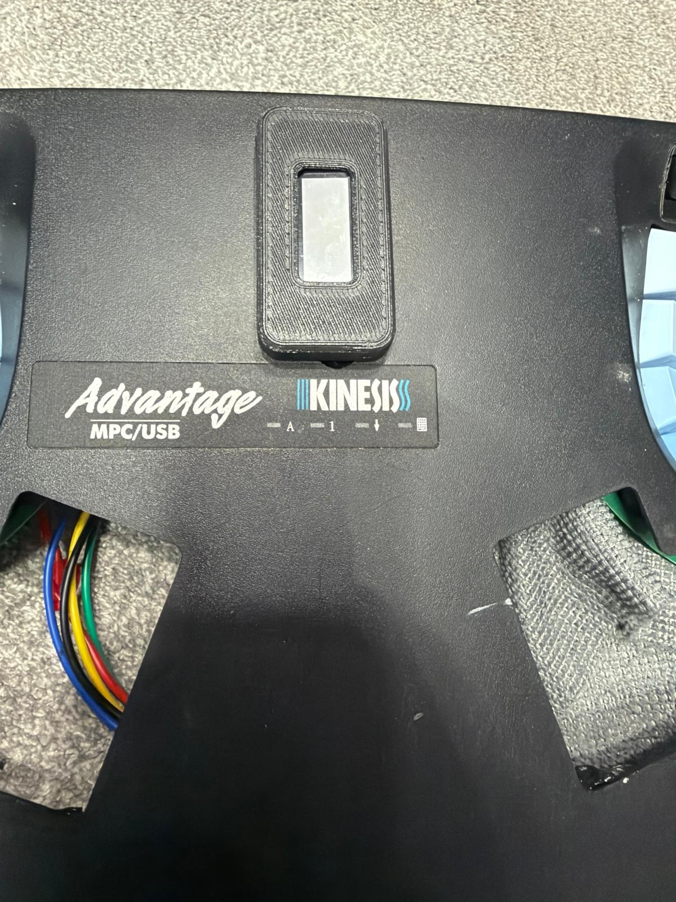
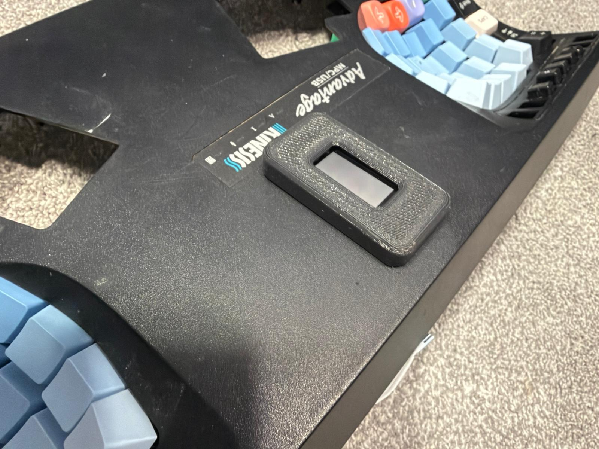

# Nice Pillz View - ZMK config and PCB

## Overview
ZMK configuration and PCB for the Nice Pillz board, a nice!nano based controller for the Kinesis
Advantage, extended with a nice!view display. Based on https://github.com/nol00p/NicePillz.
The layout is Linux/Gnome driven.

## Hardware
- The PCB in `kicad/` is updated for the display header and the switch LED, see [PCB](#pcb--ordering-from-jlcpcb) below.
- For the original design and the thumb pads, see https://github.com/nol00p/NicePillz
- For the rubber function buttons replacement with PCB for the older Advantage 1, these are excellent: https://github.com/bluelightning32/kinesis-fn
- `housing_stl/niceview_cover.stl` is a printable cover that holds the nice!view in the Kinesis top shell.

## Features supported
- [x] ZMK Studio
- [x] nice!view display (vertical): battery/charging, WPM, BT profile, layer, lock indicators
- [x] Leader key
- [x] Home row mods
- [x] Caps word
- [x] zmk-helpers
- [x] Tri-state layer
- [x] Macros, with unicode support
- [ ] Combos (supported but not yet tested)

## Battery level
Battery reporting is enabled so the level is visible in the OS. Bluetooth and power status update
too for a better experience.

## Display (nice!view)
The board carries a nice!view (Sharp 160x68 memory LCD), mounted vertically with the header pins
at the bottom. The status screen (`boards/shields/nicepillz/view_draw.c`) is drawn upright and
rotated into the panel, top to bottom:

1. **Battery** - a battery-shaped gauge plus the percentage. On USB power the gauge is replaced by
   a lightning bolt and the word *Charging*.
2. **Words per minute** - a bare number, refreshed at most every 5 s
   (`CONFIG_NICEPILLZ_WPM_INTERVAL_MS`).
3. **Output** - a Bluetooth logo with the active profile number and a tick (connected) or cross
   (bonded but not connected); a USB symbol when USB is the selected output.
4. **Layer** - five numbered dots; the filled one is the highest active layer (1-5).
5. **Lock indicators** - *Caps Lock*, *Num Lock*, *Scrl Lock* boxes at the bottom, stacked; they
   use the host's HID lock state.

Options (`boards/shields/nicepillz/Kconfig.defconfig`, override in `boards/shields/nicepillz/nicepillz.conf`):
- `CONFIG_ZMK_DISPLAY=n` disables the display entirely.
- `CONFIG_NICEPILLZ_DISPLAY_INVERTED=y` draws white on black.

`tools/preview/build.sh` compiles the real drawing code against LVGL on the host and writes
`docs/display-preview.png`, so layout changes can be checked without flashing.

Wiring: the display shares the SPI bus with the 74HC595 column driver. SCK = P0.11 (D7),
MOSI = P0.24 (D5), display CS = P1.01, powered from the nice!nano VCC pin (switched off in deep
sleep together with the shift register). On v10 boards the J9 header is in the nice!view's own pin
order (CS, GND, 3V3, SCK, MOSI, top to bottom) so the display plugs straight in. v9 boards have J9
as GND, MOSI, CS, SCK, 3V3 and need the display wired pin by pin.

## LEDs and sleep
- **PWR** (D1): on while the board is awake, driven by the spare 74HC595 output (P1.01 is the
  display chip select). Slow flash after 5 min idle, off in deep sleep.
- **BLE** (D2): on while the active Bluetooth profile is connected, off when idle or asleep.
- **Switch LED** header (v10): powers the LED inside an illuminated power switch whenever the board
  has power, see [PCB](#pcb--ordering-from-jlcpcb).

Sleep after 5 min idle: any key resumes. Deep sleep after 20 min: press the Esc key (0,0) to wake.

## PCB / ordering from JLCPCB
`kicad/nice_pillz_niceview_v10.kicad_pcb` is the board (KiCad 10). Ready-to-upload fabrication
files, exported with `kicad-cli` from the committed board (DRC: 0 unconnected items), are in
`kicad/jlcpcb/` and attached to the [v10 release](https://github.com/a10kiloham/NicePillzViewZMK/releases/tag/v10):

- `nice_pillz_niceview_v10_jlcpcb.zip` - upload this as-is to JLCPCB (2 layers, 1.6 mm).
- `gerbers/` - the same files unzipped: copper, mask, paste, silkscreen, board outline (Protel
  extensions), Excellon drills split into PTH / NPTH, and a drill map.

Changes in v10 (silkscreen v1.1) compared with the v9 boards already made:

- **J9 display header** is ordered CS, GND, 3V3, SCK, MOSI to match the nice!view (see Display above).
  Pad numbers and nets are unchanged, so the schematic still matches; only the pad positions inside
  the footprint instance moved (re-importing the footprint from the library would undo this).
- **Switch LED header** replaces the external reset terminal at the top of the board (same two holes).
  It is a 2-pin 2.54 mm header for the LED inside an illuminated power switch: the square pin (marked
  `+`) is the LED anode, fed from the switched 3.3 V rail through **R3** next to it; the round pin is
  GND. Fit R3 to suit the LED: 330 R for red/green/yellow (about 4 mA), 100 R for blue/white. The
  LED is on whenever the keyboard is powered: off when the power switch is off, off in deep sleep
  (the firmware cuts the 3.3 V rail), and on while charging over USB even with the switch off. The
  onboard reset push button is unchanged; there is no longer a terminal for an external reset.
- D1/D2 are labelled LED_PWR / LED_BLE on the fab layer.

## Hardware bill of materials
Mostly common parts and a bit of soldering.

| Position          | Part                                   | Qty | Notes |
| ----------------- | -------------------------------------- | --- | ----- |
| J1-J4, J7, J8     | Molex 39-53-2135, 13-way               | 6   | [Mouser](https://eu.mouser.com/ProductDetail/Molex/39-53-2135?qs=cm0cgiBciNYI3jeMaEn0Ng%3D%3D) |
| J5, J6            | 1x10 pin header, 2.54 mm               | 2   | |
| J9                | nice!view                              | 1   | v10: plugs onto the header; v9: wire pin by pin |
|                   | JST-EH 5-pin connector                 | 2   | display lead |
| U1                | nice!nano v2                           | 1   | |
| U2                | 74HC595                                | 1   | [Amazon](https://www.amazon.fr/dp/B093Y2MQGV) |
| U2                | 16-pin DIP socket                      | 1   | [Amazon](https://www.amazon.fr/dp/B07ZCRTRXK) |
| D1, D2            | LED (PWR, BLE)                         | 2   | [Amazon](https://www.amazon.fr/dp/B005Q2MZ4Q) |
| R1, R2            | 4.7 k resistor                         | 2   | sets LED brightness, smaller = brighter (1 k is clearly visible at 3.3 V) |
| R3                | 330 R (red/green/yellow) or 100 R (blue/white) | 1 | v10 only, switch LED series resistor |
| Battery, Ext. PWR Switch | 2-pin screw terminal, 2.54 mm   | 2   | v9 boards have a third one for an external reset |
| Switch LED        | 1x2 pin header, 2.54 mm                | 1   | v10 only |
|                   | 6 mm tactile reset button              | 1   | |
|                   | Illuminated power switch               | 1   | Adafruit; LED leads go to the Switch LED header on v10 |
|                   | 3.7 V LiPo battery, 2000 mAh           | 1   | [Amazon](https://www.amazon.fr/dp/B08214DJLJ) |
|                   | USB-C panel mount extension            | 1   | [AliExpress](https://fr.aliexpress.com/item/1005009401577622.html) |
|                   | Display cover, 3D printed              | 1   | `housing_stl/niceview_cover.stl` |

## Assembly
A small hot plate (Miniware MHP30 or a cheaper clone) makes the SMD parts much easier.
LED orientation: with the LEDs facing up, the arrow points to the left across the two pads.

## Firmware
GitHub Actions builds the firmware on every push (`build.yaml`). A prebuilt image for the
nice!nano v2 is in `firmware/nicepillz_nice_nano_v2.uf2` and on the release page. Flash it by
double-tapping reset and copying the file to the `NICENANO` drive. The `settings_reset` build from
the Actions artifacts clears Bluetooth bonds if pairing misbehaves.

## Credits
- https://github.com/nol00p/ZMK-NicePillz
- https://github.com/dcpedit/pillzmod
- https://github.com/masters3d/zmk-config-pillzmod-nicenano
- https://github.com/urob/zmk-leader-key
- https://github.com/urob/zmk-helpers
