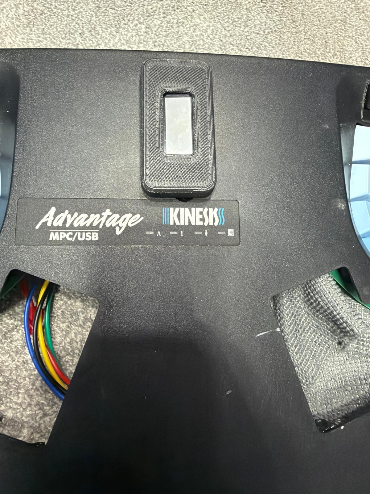
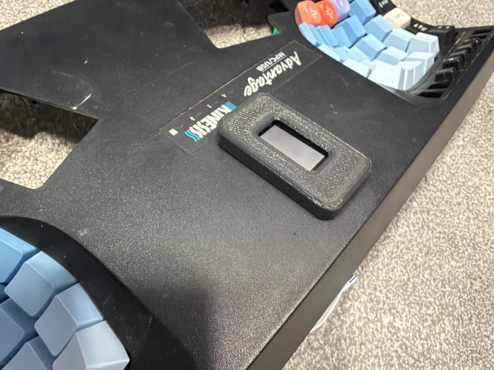
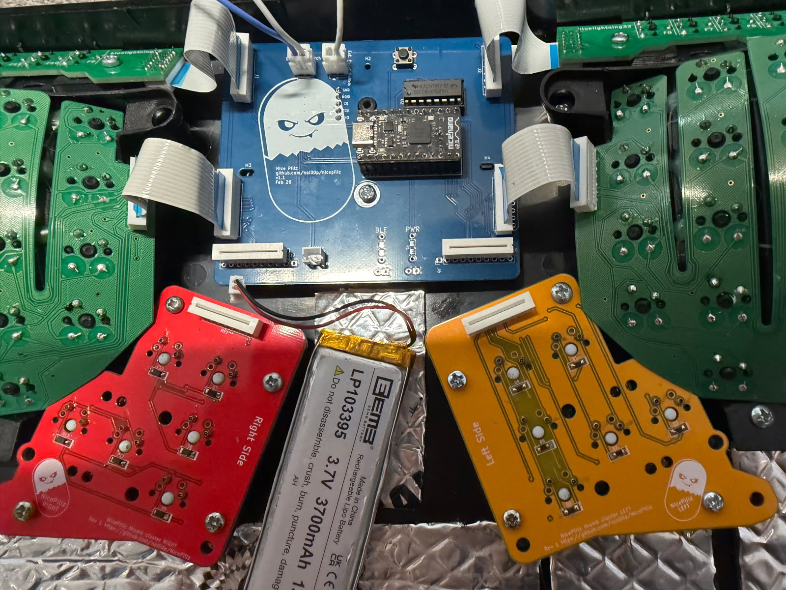
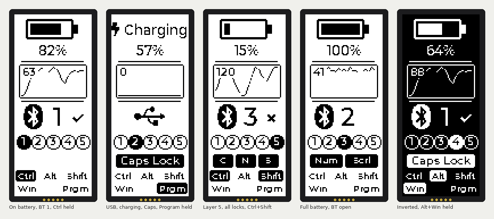
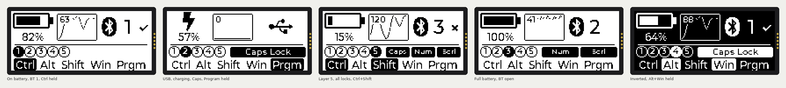

# Nice Pillz View - ZMK config and PCB

## Overview
ZMK configuration and PCB for the Nice Pillz board, a nice!nano based controller for the Kinesis
Advantage, extended with a nice!view display. Based on https://github.com/nol00p/NicePillz.
The keymap follows the Kinesis Advantage legends and targets Windows.

## Hardware
- The PCB in `kicad/` is updated for the display header and the switch LED, see [PCB](#pcb--ordering-from-jlcpcb) below.
- For the original design and the thumb pads, see https://github.com/nol00p/NicePillz
- For the rubber function buttons replacement with PCB for the older Advantage 1, these are excellent: https://github.com/bluelightning32/kinesis-fn
- `housing_stl/niceview_cover.stl` is a printable cover that holds the nice!view in the Kinesis top shell.

<p>



</p>

## Features supported
- [x] ZMK Studio
- [x] nice!view display (vertical): battery/charging, WPM, BT profile, layer, lock indicators
- [x] Leader key
- [x] Home row mods
- [x] Caps word
- [x] zmk-helpers
- [x] Layer cycle key
- [x] Macros, with unicode support
- [ ] Combos (supported but not yet tested)

## Quick reference
| Key | Function |
| --- | --- |
| F13 (the Print Screen key) | Caps Lock |
| F14 (the Scroll Lock key) | Bluetooth layer, held or tapped before the next key |
| Pause key, right of F14 | Print Screen |
| Keypad key | Layer: steps to the next layer in a loop |
| F14 then 1, 2, 3, 4 | Select Bluetooth profile 1 to 4 |
| F14 then 0 | Toggle the output between Bluetooth and USB |
| F14 then 9, held 3 seconds | Clear the current profile's pairing |
| Program (top right and right thumb) | SYSTEM layer while held |
| Program + Esc or = | Bootloader, for flashing |
| Program + left Shift or right thumb Enter | Unlock ZMK Studio |
| Caps Lock key, left side | F5 |
| Key beneath X | Win (GUI) |
| Left thumb, top | Left Ctrl, Alt |
| Right thumb, top | Program, Right Ctrl |
| Left thumb, bottom | Backspace, Delete (LOWER layer when held) |
| Right thumb, bottom | Enter, Space |

Notes:

- F13 and F14 are the Print Screen and Scroll Lock positions. Scroll Lock and Pause are not on
  the base layer.
- The Layer key loops through DEFAULT, LOWER, RAISE, FN and KEYPAD, which are dots 1 to 5 on the
  display. SYSTEM and BLUETOOTH are left out of the loop, because they are only meant to be held.
- On the FN layer the F13, F14 and Print Screen positions are mute, volume down and volume up,
  so the Bluetooth key is not available there.
- ZMK cannot switch the Bluetooth radio off. F14 then 0 switches the output between Bluetooth and
  USB instead. On battery with USB selected, the keyboard sends nothing.
- F14 then 9 clears only the selected profile. A press shorter than three seconds does nothing.
- Enter is a plain Enter. RAISE and the media-key FN layer are reached with the Layer key.
- The display shows the Bluetooth logo on the left with the profile number beside it at the same
  size. A small tick means connected, a cross means not connected, and no mark means the profile
  is free and advertising.

### Label for the bottom of the keyboard
`docs/bottom-label.txt` fits a 3 x 3 inch label. Print it in a monospace font at 8 pt.

```
NICE PILLZ VIEW - QUICK REFERENCE

TOP RIGHT  F13 Caps Lock | F14 BT |
  PrtSc | Layer | Program

BLUETOOTH  hold F14 +
  1 2 3 4   select device 1-4
  0         Bluetooth <-> USB
  9 (3 s)   forget this device

SYSTEM     hold Program +
  Esc or =  flash mode (NICENANO)
  L Shift   unlock ZMK Studio

LAYER  next layer, loops 1 to 5
  Caps Lock key = F5, under X = Win
  L thumb: Ctrl Alt / Bksp Del
  R thumb: Prog Ctrl / Enter Spc

EDIT KEYS  https://zmk.studio
github.com/a10kiloham/NicePillzViewZMK
```

## Keymap (Windows)
`config/nicepillz.keymap`. The base layer follows the key legends, with these choices:

- Caps Lock position is **F5**. Left Shift is Shift (hold-preferred, so rolling into a key always shifts) and doubles as the **leader** key when tapped on its own; right Shift is Shift.
- Home-row mods on A S D F / J K L ; (Win, Alt, Ctrl, Shift). The key beneath X is **Win**.
- Thumbs: Ctrl, Alt | Program, Ctrl on top; Backspace, Delete | Enter, Space on the big keys.
  **DEL** held = LOWER. Enter is a plain Enter.
- Top right keys after F12: **Caps Lock** (F13), **Bluetooth** (F14), **Print Screen**, **Layer**,
  **Program**. Layer steps to the next layer in a loop: DEFAULT, LOWER, RAISE, FN, KEYPAD.
- KEYPAD is the numpad layer
  (7 8 9 on U I O, 4 5 6 on J K L, 1 2 3 on M , ., 0 and . on Up/Down, Enter on / and the right
  thumb Enter). **Program** held = SYSTEM, on both the top right key and the right thumb key.
- **F14** (the Scroll Lock key) is the Bluetooth key, held or tapped before the next key:
  **1-4** select the Bluetooth profile, **0** toggles the output between Bluetooth and USB,
  **9** held for 3 seconds clears the current profile's bond.
- LOWER: F1/F2 previous/next virtual desktop, F3 task view, F4 new desktop, F8 input language,
  F9/F10 move window to the left/right monitor, F11 show desktop, F12 close desktop; arrows on
  H J K L; Ctrl+A/Z/X/C/V on the left hand.
- RAISE: Win+Left/Down/Up/Right on H J K L (snap, restore, maximise, snap), Win+M on U,
  Ctrl+= / Ctrl+- zoom on the number row, ( ) [ ] { } on E R.
- FN: media keys on the F9-F12, F13, F14 and Print Screen positions.
- SYSTEM (hold Program): **ESC or = = bootloader** (flashing mode), F1-F4 select Bluetooth
  profiles 1-4, F8 clears the current profile's bond, **left Shift or right thumb Enter = ZMK Studio unlock**.

### ZMK Studio
Open [zmk.studio](https://zmk.studio) in Chrome or Edge (Web Serial; Firefox does not work) or the
Studio desktop app, with the keyboard plugged in over USB and running normally, and choose the
`NicePillz` serial device. The keyboard starts locked: hold **Program** and tap **left Shift** to
unlock, then the keymap becomes editable. Program+Esc is *not* the Studio key, it reboots into the
bootloader for flashing, and Studio cannot connect while the `NICENANO` drive is showing.
- Leader sequences: `4` euro sign, `D 1`/`D 2` previous/next desktop, `W 1`/`W 2` move window
  left/right. Unicode macros (accented letters) type through [WinCompose](https://github.com/samhocevar/wincompose),
  which must be installed on the PC.

Keys edited in ZMK Studio are stored on the keyboard and override this file. Flashing a firmware
whose keymap file has changed discards those stored edits automatically on the first boot
(`boards/shields/nicepillz/keymap_rev.c`), so the flashed keymap is always the default. Flashing
the same keymap again keeps the Studio edits; *Restore Stock Settings* in Studio removes them.

## Battery level
Battery reporting is enabled so the level is visible in the OS. Bluetooth and power status update
too for a better experience.

## Display (nice!view)
The board carries a nice!view (Sharp 160x68 memory LCD), mounted vertically with the header pins
at the bottom. The status screen (`boards/shields/nicepillz/view_draw.c`) is drawn upright and
rotated into the panel, top to bottom:



1. **Battery** - a battery-shaped gauge plus the percentage. On USB power the gauge is replaced by
   a lightning bolt and the word *Charging*.
2. **Words per minute** - a graph of the last 24 samples (one every 5 s, so two minutes of
   history, auto-scaled) with the current value in the corner (`CONFIG_NICEPILLZ_WPM_INTERVAL_MS`).
3. **Output** - a Bluetooth logo on the left with the active profile number beside it at the
   same size, then a small tick (connected) or cross (bonded but not connected); a USB symbol
   when USB is the selected output.
4. **Layer** - five numbered dots; the filled one is the highest active layer (1-5).
5. **Lock indicators** - *Caps Lock*, *Num Lock*, *Scrl Lock* boxes, stacked; they use the
   host's HID lock state.
6. **Modifiers** - *Ctrl Alt Shift Win* along the bottom edge; a modifier lights up while it is
   held (including home-row mods).

Options (`boards/shields/nicepillz/Kconfig.defconfig`, override in `boards/shields/nicepillz/nicepillz.conf`):
- `CONFIG_ZMK_DISPLAY=n` disables the display entirely.
- `CONFIG_NICEPILLZ_DISPLAY_INVERTED=y` draws white on black.
- `CONFIG_NICEPILLZ_DISPLAY_LANDSCAPE=y` uses the landscape layout: the picture is turned 90
  degrees counterclockwise, for a display mounted with the header pins on the left. The same
  elements are rearranged for the 160x68 shape: battery, WPM graph and output on top, layer dots
  and modifiers bottom left, lock indicators bottom right.



`tools/preview/build.sh` compiles the real drawing code against LVGL on the host and writes
`docs/display-preview.png`, so layout changes can be checked without flashing.

Wiring: the display shares the SPI bus with the 74HC595 column driver. SCK = P0.11 (D7),
MOSI = P0.24 (D5), display CS = P1.01, powered from the nice!nano VCC pin (switched off in deep
sleep together with the shift register). On v10 boards the J9 header is in the nice!view's own pin
order (CS, GND, 3V3, SCK, MOSI, top to bottom) so the display plugs straight in. v9 boards have J9
as GND, MOSI, CS, SCK, 3V3 and need the display wired pin by pin.

## LEDs and sleep
- **PWR** (D1): on while the board is awake, driven by the spare 74HC595 output (P1.01 is the
  display chip select). Slow flash after 5 min idle, off in deep sleep.
- **BLE** (D2): on while the active Bluetooth profile is connected, off when idle or asleep.
- **Switch LED** header (v10): powers the LED inside an illuminated power switch whenever the board
  has power, see [PCB](#pcb--ordering-from-jlcpcb).

Sleep after 5 min idle: any key resumes. Deep sleep after 20 min: press the Esc key (0,0) to wake.

## PCB / ordering from JLCPCB
`kicad/nice_pillz_niceview_v10.kicad_pcb` is the board (KiCad 10). Ready-to-upload fabrication
files, exported with `kicad-cli` from the committed board (DRC: 0 unconnected items), are in
`kicad/jlcpcb/` and attached to the [v10 release](https://github.com/a10kiloham/NicePillzViewZMK/releases/tag/v10):

- `nice_pillz_niceview_v10_jlcpcb.zip` - upload this as-is to JLCPCB (2 layers, 1.6 mm).
- `gerbers/` - the same files unzipped: copper, mask, paste, silkscreen, board outline (Protel
  extensions), Excellon drills split into PTH / NPTH, and a drill map.

## 

Changes in v10 (silkscreen v1.1) compared with the v9 boards already made:

- **J9 display header** is ordered CS, GND, 3V3, SCK, MOSI to match the nice!view (see Display above).
  Pad numbers and nets are unchanged, so the schematic still matches; only the pad positions inside
  the footprint instance moved (re-importing the footprint from the library would undo this).
- **Switch LED header** replaces the external reset terminal at the top of the board (same two holes).
  It is a 2-pin 2.54 mm header for the LED inside an illuminated power switch: the square pin (marked
  `+`) is the LED anode, fed from the switched 3.3 V rail through **R3** next to it; the round pin is
  GND. Fit R3 to suit the LED: 330 R for red/green/yellow (about 4 mA), 100 R for blue/white. The
  LED is on whenever the keyboard is powered: off when the power switch is off, off in deep sleep
  (the firmware cuts the 3.3 V rail), and on while charging over USB even with the switch off. The
  onboard reset push button is unchanged; there is no longer a terminal for an external reset.
- D1/D2 are labelled LED_PWR / LED_BLE on the fab layer.

## Hardware bill of materials
Mostly common parts and a bit of soldering.

| Position          | Part                                   | Qty | Notes |
| ----------------- | -------------------------------------- | --- | ----- |
| J1-J4, J7, J8     | Molex 39-53-2135, 13-way               | 6   | [Mouser](https://eu.mouser.com/ProductDetail/Molex/39-53-2135?qs=cm0cgiBciNYI3jeMaEn0Ng%3D%3D) |
| J5, J6            | 1x10 pin header, 2.54 mm               | 2   | |
| J9                | nice!view                              | 1   | v10: plugs onto the header; v9: wire pin by pin |
|                   | JST-EH 5-pin connector                 | 2   | display lead |
|                   | Mill Max 0305 sockets
| U1                | nice!nano v2                           | 1   | |
| U2                | 74HC595                                | 1   | [Amazon](https://www.amazon.fr/dp/B093Y2MQGV) |
| U2                | Mill Max style connected sockets       | 1   | |
| D1, D2            | LED (PWR, BLE)                         | 2   | [Amazon](https://www.amazon.fr/dp/B005Q2MZ4Q) |
| R1, R2            | 4.7 k resistor                         | 2   | sets LED brightness, smaller = brighter (1 k is clearly visible at 3.3 V) |
| R3                | 330 R (red/green/yellow) or 100 R (blue/white) | 1 | switch LED series resistor |
| Battery, Ext. PWR Switch | 2-pin screw terminal, 2.54 mm   | 2   | v9 boards have a third one for an external reset |
| Switch LED        | 1x2 pin header, 2.54 mm                | 1   | v10 only |
|                   | 6 mm tactile reset button              | 1   | |
|                   | Illuminated power switch               | 1   | Adafruit; LED leads go to the Switch LED header on v10 |
|                   | 3.7 V LiPo battery, 2000 mAh           | 1   | [Amazon](https://www.amazon.fr/dp/B08214DJLJ) |
|                   | USB-C panel mount extension            | 1   | [AliExpress](https://fr.aliexpress.com/item/1005009401577622.html) |
|                   | Display cover, 3D printed              | 1   | `housing_stl/niceview_cover.stl` |

## 3D Printed Parts
Thanks to `happy panda` for their design here: https://www.printables.com/model/1622734-kinesis-advantage-thumb-millmax-mod
Remixed here if you're using stabilizers: https://www.printables.com/model/1842360-kinesis-thumb-cluster-pcb-replacement-millz-mod-co

## Assembly
A small hot plate (Miniware MHP30 or a cheaper clone) makes the SMD parts much easier.
LED orientation: with the LEDs facing up, the arrow points to the left across the two pads.

## Firmware
GitHub Actions builds the firmware on every push (`build.yaml`). Prebuilt images for the
nice!nano v2 are in `firmware/` and on the release page:

- `nicepillz_nice_nano_v2.uf2` - black on light (default).
- `nicepillz_nice_nano_v2_inverted.uf2` - light on black display (`CONFIG_NICEPILLZ_DISPLAY_INVERTED=y`).
- `nicepillz_nice_nano_v2_landscape.uf2` - landscape display, black on light (`CONFIG_NICEPILLZ_DISPLAY_LANDSCAPE=y`).
- `nicepillz_nice_nano_v2_landscape_inverted.uf2` - landscape display, light on black.
- `settings_reset_nice_nano_v2.uf2` - erases every stored setting: Bluetooth pairings, the keymap
  saved by ZMK Studio, and the selected output.

Flash by double-tapping reset and copying the file to the `NICENANO` drive.

To reset the settings entirely, flash `settings_reset_nice_nano_v2.uf2` first. The keyboard does
not type while it is loaded. Then double-tap reset again and flash the normal firmware. Remove the
keyboard from each computer's Bluetooth device list before pairing again.

## Credits
- https://github.com/nol00p/ZMK-NicePillz
- https://github.com/dcpedit/pillzmod
- https://github.com/masters3d/zmk-config-pillzmod-nicenano
- https://github.com/urob/zmk-leader-key
- https://github.com/urob/zmk-helpers
